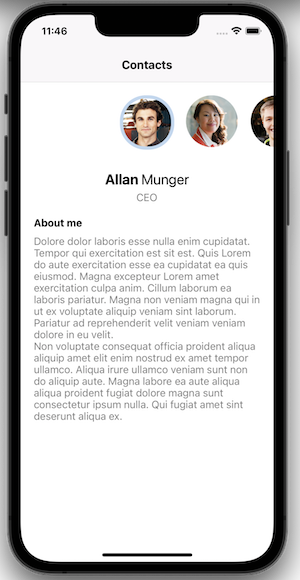

# Linked list React Native example

## Description




## Setup

- Install React Native and dependencies

```
yarn
(cd ios && pod install)
```

- Generate test data

``` 
yarn generate-data
```

- Run metro bundler and build app for ios or android (make sure you already set up ios simulator and android sdk)

``` 
yarn start
yarn ios or yarn android
```

## Tests

- Run unit tests

``` 
yarn test
```


